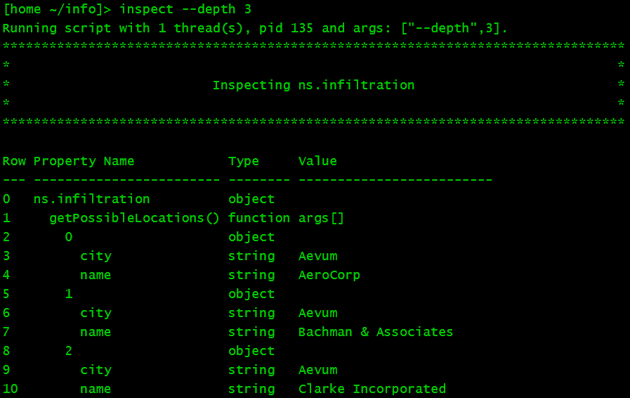

# Introspection Script for Bitburner

Display available methods and properties of a given object.
Useful if `JSON.stringify()` and autocomplete in the text editor are not good enough.

Features:
* Show types and values of object properties.
* Go to deeper levels at once by specifying a `--depth` value, or `--expand` a specific object.
* Use `--doc` to quickly go to the documentation page for an object.

## Screenshot

<!---->


## Source file
[inspect.js](inspect.js)

## Installation
Either copy and paste from the source file, or enter the following in the Bitburner terminal.
```
wget https://raw.githubusercontent.com/jkornelsen/bitburner/main/inspect.js inspect.js
````

## Basic Usage

Before running, modify the value of `objToInspect` to specify the initial object.
Or if you just want to see how it works, `ns.infiltration` is a safe place to start.

Then enter the following:
```
alias inspect="run inspect.js"
inspect --help
inspect
```

## Methods You Don't Want to Call

Inspecting to a depth of higher than 1 can lead to methods getting called that you don't want.
So back up the game first in case this happens.

For example, while developing this script, I accidentally called `ns.corporation.goPublic()`.
This can only happen for methods without parameters.

To avoid this, before increasing the depth,
make changes to the `functionArgs` object for any 0-argument functions shown at the current depth.
`goPublic()` is already included, so you shouldn't have that particular problem.

## Ram Error

This script will fail to run if it uses more dynamic ram than expected.
This may pop up an error message, or it may write the error to the tail window and produce no output to the terminal.

To make the game understand how much ram is required,
add more lines to the `increaseStaticRamCostOfThisScript` function, or comment out some lines.
If you don't yet have 1024 Gb of ram, then you'll need to comment out some lines,
but that means that you won't be able to inspect objects that require a lot of ram.
